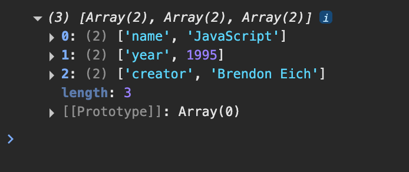

# 006 - Object Tricks

## making an Array using Object's keys

```javascript
const language = {
  name: "JavaScript",
  year: 1995,
  creator: "Brendon Eich",
};

console.log(Object.keys(language));
```

```bash
['name', 'year', 'creator']
```

**------------------------------------------------------------------------------------------------------------------------**

## making an Array using Object's values

```javascript
const language = {
  name: "JavaScript",
  year: 1995,
  creator: "Brendon Eich",
};

console.log(Object.values(language));
```

```bash
['JavaScript', 1995, 'Brendon Eich']
```

**------------------------------------------------------------------------------------------------------------------------**

## making an Array using Object's keys and values.

```javascript
const language = {
  name: "JavaScript",
  year: 1995,
  creator: "Brendon Eich",
};

console.log(Object.entries(language));
```



**------------------------------------------------------------------------------------------------------------------------**

## setting a dynamic value to an Object

```javascript
const language = {
  name: "JavaScript",
  year: 1995,
  creator: "Brendon Eich",
};
language.popularity = "100%";
console.log(language);
```

```bash
{name: 'JavaScript', year: 1995, creator: 'Brendon Eich', popularity: '100%'}
```

---

```javascript
const language = {
  name: "JavaScript",
  year: 1995,
  creator: "Brendon Eich",
};
const a = "popularity";
language.a = "100%";
console.log(language);
```

```bash
{name: 'JavaScript', year: 1995, creator: 'Brendon Eich', a: '100%'}
```

---

```javascript
const language = {
  name: "JavaScript",
  year: 1995,
  creator: "Brendon Eich",
};
const a = "popularity";
language[a] = "100%";
console.log(language);
```

```bash
{name: 'JavaScript', year: 1995, creator: 'Brendon Eich', popularity: '100%'}
```

---

```javascript
const a = "popularity";

const language = {
  name: "JavaScript",
  year: 1995,
  creator: "Brendon Eich",
  a, //? we can use like this if key and value name are same
};
console.log(language);
```

```bash
{name: 'JavaScript', year: 1995, creator: 'Brendon Eich', a: 'popularity'}
```
