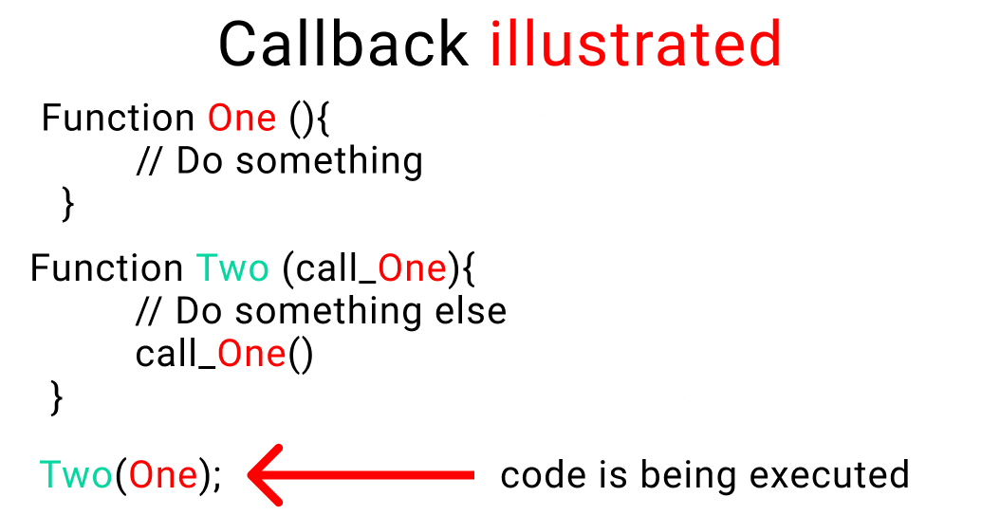
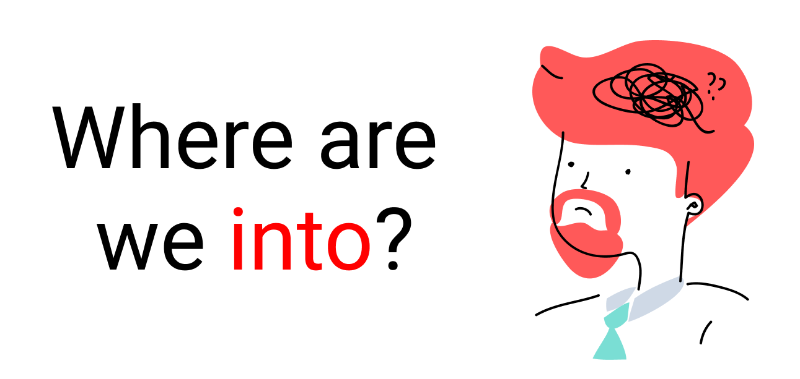
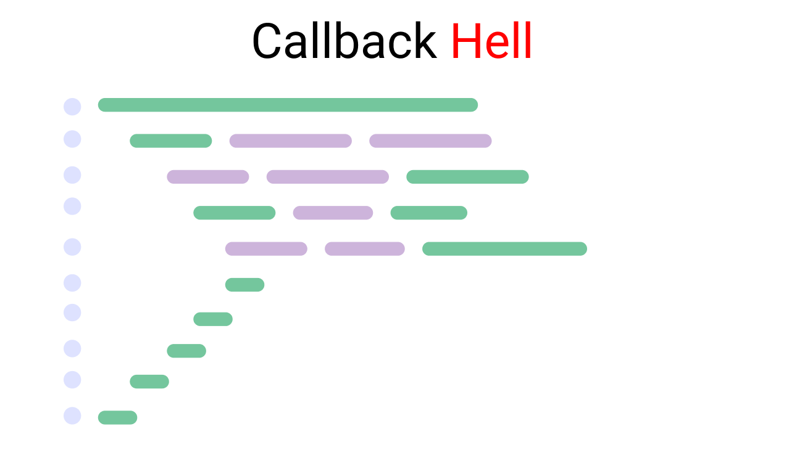
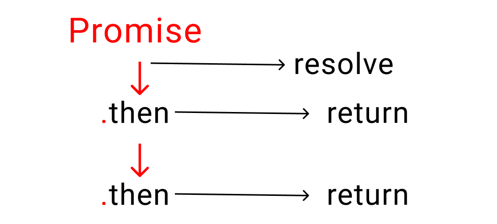
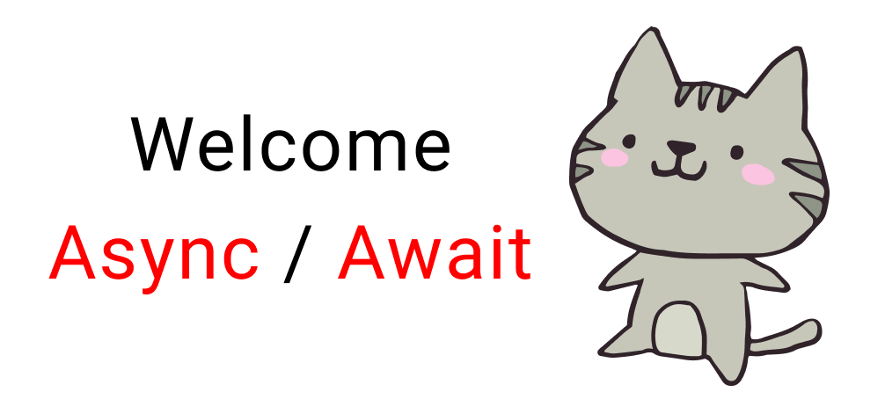
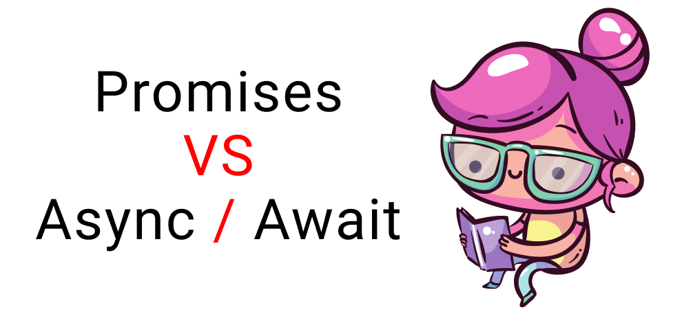

# Asynchronous JavaScript
[Freecodecamp](https://www.freecodecamp.org/news/javascript-async-await-tutorial-learn-callbacks-promises-async-await-by-making-icecream/)
The theory of async JavaScript helps you break down big complex projects into smaller tasks.

Then you can use any of these three techniques – callbacks, promises or Async/await – to run those small tasks in a way that you get the best results.

```js
async function getData(){
    const response = await fetch("https://jsonplaceholder.typicode.com/posts/1")
    const data = await response.json()
    console.log(data);
}
getData();
```
```bash
{userId: 1, id: 1, title: 'sunt aut facere repellat provident occaecati excepturi optio reprehenderit', body: 'quia et suscipit\nsuscipit recusandae consequuntur …strum rerum est autem sunt rem eveniet architecto'}
```

----------------------------------------------------------------------------------------------------------------------------------------

**Asynchronous function always return promis**
```js
async function getData(){
    const response = await fetch("https://jsonplaceholder.typicode.com/posts/1")
    const data = await response.json()
    console.log(data);
}

function bigWork(){
    return getData();
}

(async function(){
    await bigWork();
})()
```

**-------------------------------------------------------------------------------------------------------------------------------------------**

# Synchronous vs Asynchronous JavaScript
**What is a Synchronous System?**
Think of this as if you have just one hand to accomplish 10 tasks. So, you have to complete one task at a time.


You'll see that until the first image is loaded completely, the second image doesn't start loading.
Well, JavaScript is by default Synchronous **[single threaded]**. Think about it like this – one thread means one hand with which to do stuff.

**What is an Asynchronous System?**
In this system, tasks are completed independently.
Here, imagine that for 10 tasks, you have 10 hands. So, each hand can do each task independently and at the same time.

Take a look at the GIF 👇 – you can see that each image loads at the same time.

Again, all the images are loading at their own pace. None of them is waiting for any of the others.

```js
//! Synchronous
console.log("I eat");
console.log("icecream");
console.log("with a");
console.log("spoon");
```
```bash
I eat
icecream
with a
spoon
```

------------------------------------------------------------------------------------------------------------------------------------------

```js
//! Asynchronous
console.log("I eat");
//? it will run after 4 seconds. this is called asynchronous
setTimeout(()=> {
console.log("icecream");
}, 4000) //? here 4000 is milisecond, 4 seconds
console.log("with a");
console.log("spoon");
```
```bash
I eat
with a
spoon
icecream
```

**------------------------------------------------------------------------------------------------------------------------------------------**

**What are Callbacks in JavaScript?**
When you nest a function inside another function as an argument, that's called a callback.
Here's an illustration of a callback:


**Why do we use callbacks?**
When doing a complex task, we break that task down into smaller steps. To help us establish a relationship between these steps according to time (optional) and order, we use callbacks.
```js
function one(){
    console.log("Step 1");
}

function two(){
    console.log("Step 2");
}

one();
two();
```
```bash
Step 1
Step 2
```

--------------------------------------------------------------------------------------------------------------------------------------

```js
function one(){
    console.log("Step 1");
}

function two(){
    console.log("Step 2");
}

two();
one();
```
```bash
Step 2
Step 1
```

----------------------------------------------------------------------------------------------------------------------------------------

```js
function one(call_two){
    console.log("Step 1 is complete. Please call step 2");
    call_two()
}

function two(){
    console.log("Step 2");
}

one(two)
```
```bash
Step 1 is complete. Please call step 2
Step 2
```

--------------------------------------------------------------------------------------------------------------------------------------

```js
function one(call_two){
    call_two()
    console.log("Step 1 is complete. Please call step 2");
}

function two(){
    console.log("Step 2");
}

one(two)
```
```bash
Step 2
script.js:3 Step 1 is complete. Please call step 2
```

---------------------------------------------------------------------------------------------------------------------------------------

```js
let order = (callProduction) => {
    console.log("Order Placed, pleade call production");
    callProduction();
}

let profduction = () =>{
    console.log("order received, starting production");
}

order(profduction)
```
```bash
Order Placed, pleade call production
order received, starting production
```

-------------------------------------------------------------------------------------------------------------------------------------

```js
let stocks = {
    Fruits : ["Strawberry", "grapes", "banana", "apple"]
}
console.log(stocks.Fruits[2]);

// let order = (callProduction) => {
//     console.log("Order Placed, pleade call production");
//     callProduction();
// }

// let profduction = () =>{
//     console.log("order received, starting production");
// }

// order(profduction)
```
```bash
banana
```

--------------------------------------------------------------------------------------------------------------------------------------

```js
let stocks = {
    Fruits : ["strawberry", "grapes", "banana", "apple"],
    liquid : ["water", "ice"],
    holder : ["cone", "cup", "stick"],
    toppings : ["chocolate", "peanuts"],
};

let order = (fruitName, callProduction) => {

    setTimeout(()=>{
        console.log(`${stocks.Fruits[fruitName]} was selected`);
    }, 2000)
    callProduction();
}

let profduction = () =>{
    
}

order(0, profduction)
```
```bash
strawberry was selected
```

----------------------------------------------------------------------------------------------------------------------------------

```js
let stocks = {
    Fruits : ["strawberry", "grapes", "banana", "apple"],
    liquid : ["water", "ice"],
    holder : ["cone", "cup", "stick"],
    toppings : ["chocolate", "peanuts"],
};

let order = (fruitName, callProduction) => {

    setTimeout(()=>{
        console.log(`${stocks.Fruits[fruitName]} was selected`);
    }, 2000)
    callProduction();
}

let profduction = () =>{
    
    setTimeout(()=>{
        console.log("Production has started");
    }, 0)
}

order(0, profduction)
```
```bash
Production has started
strawberry was selected
```

------------------------------------------------------------------------------------------------------------------------------------

```js
let stocks = {
    Fruits : ["strawberry", "grapes", "banana", "apple"],
    liquid : ["water", "ice"],
    holder : ["cone", "cup", "stick"],
    toppings : ["chocolate", "peanuts"],
};

let order = (fruitName, callProduction) => {

    setTimeout(()=>{
        console.log(`${stocks.Fruits[fruitName]} was selected`);
        callProduction();
    }, 2000)
}

let profduction = () =>{
    
    setTimeout(()=>{
        console.log("Production has started");
    }, 0)
}

order(0, profduction)
```
```bash
strawberry was selected
Production has started
```

-------------------------------------------------------------------------------------------------------------------------------------

```js
let stocks = {
    Fruits : ["strawberry", "grapes", "banana", "apple"],
    liquid : ["water", "ice"],
    holder : ["cone", "cup", "stick"],
    toppings : ["chocolate", "peanuts"],
};

let order = (fruitName, callProduction) => {

    setTimeout(()=>{
        console.log(`${stocks.Fruits[fruitName]} was selected`);
        callProduction();
    }, 2000)
}

let profduction = () =>{
    
    setTimeout(()=>{
        console.log("Production has started");
        setTimeout(()=>{
            console.log("The fruit has been chopped");
        }, 2000)
    }, 0)

}

order(0, profduction)
```
```bash
strawberry was selected
Production has started
The fruit has been chopped
```

-------------------------------------------------------------------------------------------------------------------------------------

```js
let stocks = {
    Fruits : ["strawberry", "grapes", "banana", "apple"],
    liquid : ["water", "ice"],
    holder : ["cone", "cup", "stick"],
    toppings : ["chocolate", "peanuts"],
};

let order = (fruitName, callProduction) => {

    setTimeout(()=>{
        console.log(`${stocks.Fruits[fruitName]} was selected`);
        callProduction();
    }, 2000)
}

let profduction = () =>{
    
    setTimeout(()=>{
        console.log("Production has started");
        setTimeout(()=>{
            console.log("The fruit has been chopped");
            setTimeout(()=>{
                console.log(`${stocks.liquid[0]} and ${stocks.liquid[1]} was added`);
            }, 1000)
        }, 2000)
    }, 0)

}

order(0, profduction)
```
```bash
strawberry was selected
Production has started
The fruit has been chopped
water and ice was added
```

-------------------------------------------------------------------------------------------------------------------------------------

```js
let stocks = {
    Fruits : ["strawberry", "grapes", "banana", "apple"],
    liquid : ["water", "ice"],
    holder : ["cone", "cup", "stick"],
    toppings : ["chocolate", "peanuts"],
};

let order = (fruitName, callProduction) => {

    setTimeout(()=>{
        console.log(`${stocks.Fruits[fruitName]} was selected`);
        callProduction();
    }, 2000)
}

let profduction = () =>{
    
    setTimeout(()=>{
        console.log("Production has started");
        setTimeout(()=>{
            console.log("The fruit has been chopped");
            setTimeout(()=>{
                console.log(`${stocks.liquid[0]} and ${stocks.liquid[1]} was added`);
                setTimeout(()=>{
                    console.log("The machine was started");
                    setTimeout(()=>{
                        console.log(`Ice cream was placed on ${stocks.holder[0]}`);
                        setTimeout(()=>{
                            console.log(`${stocks.toppings[0]} was added as toppings`);
                            setTimeout(()=>{
                                console.log("Serve Ice-cream");
                            }, 2000)
                        }, 3000)
                    }, 2000)
                }, 1000)
            }, 1000)
        }, 2000)
    }, 0)

}

order(0, profduction)
```
```bash
strawberry was selected
Production has started
The fruit has been chopped
water and ice was added
The machine was started
Ice cream was placed on cone
chocolate was added as toppings
Serve Ice-cream
```

**Feeling confused?**


This is called callback hell. It looks something like this (remember that code just above?): 👇


Illustration of Callback hell

What's the solution to this?

**How to Use Promises to Escape Callback Hell**

Promises were invented to solve the problem of callback hell and to better handle our tasks.

This is how a promise looks:

**illustration of a promise format**


**An illustration of the life of a promise**

As the above charts show, a promise has three states:

- **Pending:** This is the initial stage. Nothing happens here. Think of it like this, your customer is taking their time giving you an order. But they haven't ordered anything yet.
- **Resolved:** This means that your customer has received their food and is happy.
**Rejected:** This means that your customer didn't receive their order and left the restaurant.

Let's adopt promises to our ice cream production case study.

**But wait...**


We need to understand four more things first ->

- Relationship between time and work
- Promise chaining
- Error handling
- The .finally handler

Let's start our ice cream shop and understand each of these concepts one by one by taking baby steps.

**Relationship between time and work**
If you remember, these are our steps and the time each takes to make ice cream"


**Chart contains steps to make ice cream**

```js
let stocks = {
    Fruits : ["strawberry", "grapes", "banana", "apple"],
    liquid : ["water", "ice"],
    holder : ["cone", "cup", "stick"],
    toppings : ["chocolate", "peanuts"],
};

let isShopOpen = true;

let order = (time, work) =>{
    return new Promise((resolve, reject)=>{
        if(isShopOpen){
            setTimeout(()=>{
                resolve(work())
            }, time)
            
        }else{
            reject(console.log("Our shop is closed"))
        }
    })
}
order(2000, ()=>console.log(`${stocks.Fruits[0]} was selected`))
```
```bash
strawberry was selected
```

**Promise chaining**
In this method, we defining what we need to do when the first task is complete using the .then handler. It looks something like this 👇

**Illustration of promise chaining using .then handler**

The **.then** handler returns a promise when our original promise is resolved.

Let me make it simpler: it's similar to giving instructions to someone. You tell someone to " First do this, then do that, then this other thing, then.., then.., then..." and so on.

- The first task is our original promise.
- The rest of the tasks return our promise once one small bit of work is completed

Let's implement this on our project. At the bottom of your code write the following lines. 👇

**Note:**don't forget to write the **return** word inside your **.then** handler. Otherwise, it won't work properly. If you're curious, try removing the return once we finish the steps:

```js
let stocks = {
    Fruits : ["strawberry", "grapes", "banana", "apple"],
    liquid : ["water", "ice"],
    holder : ["cone", "cup", "stick"],
    toppings : ["chocolate", "peanuts"],
};

let isShopOpen = true;

let order = (time, work) =>{
    return new Promise((resolve, reject)=>{
        if(isShopOpen){
            setTimeout(()=>{
                resolve(work())
            }, time)
            
        }else{
            reject(console.log("Our shop is closed"))
        }
    })
}
order(2000, ()=>console.log(`${stocks.Fruits[0]} was selected`))
.then(()=>{
    return order(0, ()=>console.log("Production has started"))
})
.then(()=>{
    return order(2000, ()=>console.log("The fruit was chopped"))
})
.then(()=>{
    return order(1000, ()=>{
        console.log(`${stocks.liquid[0]} and ${stocks.liquid[1]} was selected`);
    })
})
.then(()=>{
    return order(1000, ()=>console.log("Start the machine"))
})
.then(()=>{
    return order(2000, ()=>{
        console.log(`Ice cream is placed on ${stocks.holder[0]}`);
    })
})
.then(()=>{
    return order(3000, ()=>{
        console.log(`${stocks.toppings[0]} was selected`);
    })
})
.then(()=>{
    return order(1000, ()=>console.log("Ice cream was served"))
})
```
```bash
strawberry was selected
Production has started
The fruit was chopped
water and ice was selected
Start the machine
Ice cream is placed on cone
chocolate was selected
Ice cream was served
```

**Error handling**
We need a way to handle errors when something goes wrong. But first, we need to understand the promise cycle:


**An illustration of the life of a promise**

To catch our errors, let's change our variable to false.

```js
let is_shop_open = false;
```

Which means our shop is closed. We're not selling ice cream to our customers anymore.

To handle this, we use the **.catch** handler. Just like **.then**, it also returns a promise, but only when our original promise is rejected.

A small reminder here:

- **.then** works when a promise is resolved
- **.catch** works when a promise is rejected

Go down to the very bottom and write the following code:👇
Just remember that there should be nothing between your previous .then handler and the .catch handler.
```js
.catch(()=>{
  console.log("Customer left")
})
```

```js
let stocks = {
    Fruits : ["strawberry", "grapes", "banana", "apple"],
    liquid : ["water", "ice"],
    holder : ["cone", "cup", "stick"],
    toppings : ["chocolate", "peanuts"],
};

let isShopOpen = false;

let order = (time, work) =>{
    return new Promise((resolve, reject)=>{
        if(isShopOpen){
            setTimeout(()=>{
                resolve(work())
            }, time)
            
        }else{
            reject(console.log("Our shop is closed"))
        }
    })
}
order(2000, ()=>console.log(`${stocks.Fruits[0]} was selected`))
.then(()=>{
    return order(0, ()=>console.log("Production has started"))
})
.then(()=>{
    return order(2000, ()=>console.log("The fruit was chopped"))
})
.then(()=>{
    return order(1000, ()=>{
        console.log(`${stocks.liquid[0]} and ${stocks.liquid[1]} was selected`);
    })
})
.then(()=>{
    return order(1000, ()=>console.log("Start the machine"))
})
.then(()=>{
    return order(2000, ()=>{
        console.log(`Ice cream is placed on ${stocks.holder[0]}`);
    })
})
.then(()=>{
    return order(3000, ()=>{
        console.log(`${stocks.toppings[0]} was selected`);
    })
})
.then(()=>{
    return order(1000, ()=>console.log("Ice cream was served"))
})

.catch(()=>{
    console.log("Customer left");
})
```
```bash
Our shop is closed
Customer left
```

**A couple things to note about this code:**

- The 1st message is coming from the **reject()** part of our promise
- The 2nd message is coming from the **.catch** handler

**How to use the .finally() handler**


There's something called the **finally** handler which works regardless of whether our promise was resolved or rejected.

**For example:** whether we serve no customers or 100 customers, our shop will close at the end of the day

If you're curious to test this, come at very bottom and write this code: 👇

```js
.finally(()=>{
  console.log("end of day")
})
```

-------------------------------------------------------------------------------------------------------------------------------------

```js
let stocks = {
    Fruits : ["strawberry", "grapes", "banana", "apple"],
    liquid : ["water", "ice"],
    holder : ["cone", "cup", "stick"],
    toppings : ["chocolate", "peanuts"],
};

let isShopOpen = false;

let order = (time, work) =>{
    return new Promise((resolve, reject)=>{
        if(isShopOpen){
            setTimeout(()=>{
                resolve(work())
            }, time)
            
        }else{
            reject(console.log("Our shop is closed"))
        }
    })
}
order(2000, ()=>console.log(`${stocks.Fruits[0]} was selected`))
.then(()=>{
    return order(0, ()=>console.log("Production has started"))
})
.then(()=>{
    return order(2000, ()=>console.log("The fruit was chopped"))
})
.then(()=>{
    return order(1000, ()=>{
        console.log(`${stocks.liquid[0]} and ${stocks.liquid[1]} was selected`);
    })
})
.then(()=>{
    return order(1000, ()=>console.log("Start the machine"))
})
.then(()=>{
    return order(2000, ()=>{
        console.log(`Ice cream is placed on ${stocks.holder[0]}`);
    })
})
.then(()=>{
    return order(3000, ()=>{
        console.log(`${stocks.toppings[0]} was selected`);
    })
})
.then(()=>{
    return order(1000, ()=>console.log("Ice cream was served"))
})

.catch(()=>{
    console.log("Customer left");
})

.finally(()=>{
    console.log("Day ended, shop is closed");
})
```
```bash
Our shop is closed
Customer left
Day ended, shop is closed
```

---------------------------------------------------------------------------------------------------------------------------------------

```js
let stocks = {
    Fruits : ["strawberry", "grapes", "banana", "apple"],
    liquid : ["water", "ice"],
    holder : ["cone", "cup", "stick"],
    toppings : ["chocolate", "peanuts"],
};

let isShopOpen = true;

let order = (time, work) =>{
    return new Promise((resolve, reject)=>{
        if(isShopOpen){
            setTimeout(()=>{
                resolve(work())
            }, time)
            
        }else{
            reject(console.log("Our shop is closed"))
        }
    })
}
order(2000, ()=>console.log(`${stocks.Fruits[0]} was selected`))
.then(()=>{
    return order(0, ()=>console.log("Production has started"))
})
.then(()=>{
    return order(2000, ()=>console.log("The fruit was chopped"))
})
.then(()=>{
    return order(1000, ()=>{
        console.log(`${stocks.liquid[0]} and ${stocks.liquid[1]} was selected`);
    })
})
.then(()=>{
    return order(1000, ()=>console.log("Start the machine"))
})
.then(()=>{
    return order(2000, ()=>{
        console.log(`Ice cream is placed on ${stocks.holder[0]}`);
    })
})
.then(()=>{
    return order(3000, ()=>{
        console.log(`${stocks.toppings[0]} was selected`);
    })
})
.then(()=>{
    return order(1000, ()=>console.log("Ice cream was served"))
})

.catch(()=>{
    console.log("Customer left");
})

.finally(()=>{
    console.log("Day ended, shop is closed");
})
```
```bash
strawberry was selected
Production has started
The fruit was chopped
water and ice was selected
Start the machine
Ice cream is placed on cone
chocolate was selected
Ice cream was served
Day ended, shop is closed
```

**How Does Async / Await Work in JavaScript?**


This is supposed to be the better way to write promises and it helps us keep our code simple and clean.

All you have to do is write the word **async** before any regular function and it becomes a **promise**.

Let's have a look:👇



**Promises vs Async/Await in JavaScript**

Before async/await, to make a promise we wrote this:
```js
function order(){
   return new Promise( (resolve, reject) =>{

    // Write code here
   } )
}
```

Now using async/await, we write one like this:
```js
//👇 the magical keyword
 async function order() {
    // Write code here
 }
 ```

**But wait......**

You need to understand ->
- How to use the **try** and **catch** keywords
- How to use the **await** keyword

**How to use the Try and Catch keywords**
We use the **try** keyword to run our code while we use **catch** to catch our errors. It's the same concept we saw when we looked at promises.

**Promises in JS -> resolve or reject**
We used resolve and reject in promises like this:
```js
function kitchen(){

  return new Promise ((resolve, reject)=>{
    if(true){
       resolve("promise is fulfilled")
    }

    else{
        reject("error caught here")
    }
  })
}

kitchen()  // run the code
.then()    // next step
.then()    // next step
.catch()   // error caught here
.finally() // end of the promise [optional]
```

**Async / Await in JS -> try, catch**
When we're using async/await, we use this format:
```js
//👇 Magical keyword
async function kitchen(){

   try{
// Let's create a fake problem      
      await abc;
   }

   catch(error){
      console.log("abc does not exist", error)
   }

   finally{
      console.log("Runs code anyways")
   }
}

kitchen()  // run the code
```

**How to Use JavaScript's Await Keyword**


The keyword await makes JavaScript wait until a promise settles and returns its result.

**How to use the await keyword in JavaScript**
Let's go back to our ice cream shop. We don't know which topping a customer might prefer, chocolate or peanuts. So we need to stop our machine and go and ask our customer what they'd like on their ice cream.

Notice here that only our kitchen is stopped, but our staff outside the kitchen will still do things like:

- doing the dishes
- cleaning the tables
- taking orders, and so on.

**An Await Keyword Code Example**

Let's create a small promise to ask which topping to use. The process takes three seconds.
```js
let stocks = {
    Fruits : ["strawberry", "grapes", "banana", "apple"],
    liquid : ["water", "ice"],
    holder : ["cone", "cup", "stick"],
    toppings : ["chocolate", "peanuts"],
};

let isShopOpen = true;

// Let's create a small promise to ask which topping to use. The process takes three seconds.
let toppingsChoice = () =>{
    return new Promise((resolve, reject)=>{
        setTimeout(()=>{
            resolve(console.log("Which topping would you love?"))
        }, 3000)
    })
}

// Now, let's create our kitchen function with the async keyword first.
async function kitchen(){
    console.log("A");
    console.log("B");
    console.log("C");
    await toppingsChoice();
    console.log("D");
    console.log("E");
}

kitchen()
```
```bash
A
B
C
Which topping would you love?
D
E
```

-----------------------------------------------------------------------------------------------------------------------------------

```js
let stocks = {
    Fruits : ["strawberry", "grapes", "banana", "apple"],
    liquid : ["water", "ice"],
    holder : ["cone", "cup", "stick"],
    toppings : ["chocolate", "peanuts"],
};

let isShopOpen = true;

// Let's create a small promise to ask which topping to use. The process takes three seconds.
let toppingsChoice = () =>{
    return new Promise((resolve, reject)=>{
        setTimeout(()=>{
            resolve(console.log("Which topping would you love?"))
        }, 3000)
    })
}

// Now, let's create our kitchen function with the async keyword first.
async function kitchen(){
    console.log("A");
    console.log("B");
    console.log("C");
    await toppingsChoice();
    console.log("D");
    console.log("E");
}

kitchen()

// Let's add other tasks below the kitchen() call.
console.log("doing the dishes")
console.log("cleaning the tables")
console.log("taking orders")
```
```bash
A
B
C
doing the dishes
cleaning the tables
taking orders
Which topping would you love?
D
E
```
We are literally going outside our kitchen to ask our customer, "what is your topping choice?" In the mean time, other things still get done.

Once, we get their topping choice, we enter the kitchen and finish the job.

**Small note**
Small note
When using Async/ Await, you can also use the **.then**, **.catch**, and **.finally** handlers as well which are a core part of promises.

**Let's open our Ice cream shop again**


We're gonna create two functions ->
- **kitchen:** to make ice cream
- **time:** to assign the amount of time each small task will take.

```js
let stocks = {
    Fruits : ["strawberry", "grapes", "banana", "apple"],
    liquid : ["water", "ice"],
    holder : ["cone", "cup", "stick"],
    toppings : ["chocolate", "peanuts"],
};

let isShopOpen = true;

function time(ms){
    return new Promise((resolve, reject)=>{
        if(isShopOpen){
            setTimeout(resolve, ms)
        }else{
            reject(console.log("shop is closed"))
        }
    })
}

async function kitchen(){
    try{
    await time(2000)
    console.log(`${stocks.Fruits[0]} was selected`)

    await time(0)
    console.log("production has started")

    await time(2000)
    console.log("fruit has been chopped")

    await time(1000)
    console.log(`${stocks.liquid[0]} and ${stocks.liquid[1]} added`)

    await time(1000)
    console.log("start the machine")

    await time(2000)
    console.log(`ice cream placed on ${stocks.holder[1]}`)

    await time(3000)
    console.log(`${stocks.toppings[0]} as toppings`)

    await time(2000)
    console.log("Serve Ice Cream")
    }catch(error){
        console.log("customer left", error);
    }finally{
        console.log("Day ended, shop is closed");
    }
}

kitchen()
```
```bash
strawberry was selected
production has started
fruit has been chopped
water and ice added
start the machine
ice cream placed on cup
chocolate as toppings
Serve Ice Cream
Day ended, shop is closed
```

--------------------------------------------------------------------------------------------------------------------------------------

```js
let stocks = {
    Fruits : ["strawberry", "grapes", "banana", "apple"],
    liquid : ["water", "ice"],
    holder : ["cone", "cup", "stick"],
    toppings : ["chocolate", "peanuts"],
};

let isShopOpen = false;

function time(ms){
    return new Promise((resolve, reject)=>{
        if(isShopOpen){
            setTimeout(resolve, ms)
        }else{
            reject("shop is closed")
        }
    })
}

async function kitchen(){
    try{
    await time(2000)
    console.log(`${stocks.Fruits[0]} was selected`)

    await time(0)
    console.log("production has started")

    await time(2000)
    console.log("fruit has been chopped")

    await time(1000)
    console.log(`${stocks.liquid[0]} and ${stocks.liquid[1]} added`)

    await time(1000)
    console.log("start the machine")

    await time(2000)
    console.log(`ice cream placed on ${stocks.holder[1]}`)

    await time(3000)
    console.log(`${stocks.toppings[0]} as toppings`)

    await time(2000)
    console.log("Serve Ice Cream")
    }catch(error){
        console.log("customer left", error);
    }finally{
        console.log("Day ended, shop is closed");
    }
}

kitchen()
```
```bash
customer left shop is closed
Day ended, shop is closed
```