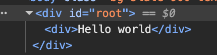

# Introduction to React

## React is Library(JavaScript Library. Build on JavaScript Language) not a Framework
**Library** ---> Not a complete package. focused on particular things -- Like **React** only focus on making **user interface(UI)**

**Framework** ---> A complete package -- A tool set. work with multiple things. Like to make a full website what we needs all are availble on Framework

## Difference between vanila JavaScript and React
**vanila**
```html
<!DOCTYPE html>
<html>
    <head>
        <meta charset="UTF-8" />
        <meta name="viewport" content="width=device-width, initial-scale=1.0" />
        <title>Why React - Vanilla JS vs React.js</title>
        <script src="https://cdn.tailwindcss.com"></script>
        <link href="./images/favicon.png" rel="shortcut icon" />
    </head>
    <body
        class="bg-slate-900 text-slate-400 flex items-center justify-center h-screen px-10"
    >
        <div class="shadow-md rounded-lg bg-slate-800 border-slate-700">
            <a href="#">
                
            </a>
            <div class="px-5 py-5">
                <div class="flex items-center justify-between mt-5">
                    <a href="#">
                        <h3 class="font-semibold text-xl tracking-tight">
                            Reactive Accelerator Course
                        </h3>
                    </a>
                    <span id="total" class="text-xl font-medium text-teal-500"
                        ></span
                    >
                </div>
                <div class="flex items-center justify-between mt-5">
                    <span id="price" class="text-2xl font-bold text-slate-300"
                        ></span
                    >
                    <a
                        id="button"
                        href="#"
                        class="text-white focus:ring-4 font-medium rounded-lg text-sm px-5 py-2.5 text-center bg-[#087ea4] hover:bg-[#087ea4]/[.8] focus:ring-[#087ea4]/[.5]"
                        >Add to cart</a
                    >
                </div>
            </div>
        </div>
        <script src="script.js"></script>
    </body>
</html>
```
```js
//! catch DOM elements 
const button = document.getElementById("button");
const price = document.getElementById('price');
const total = document.getElementById('total');


//! state or data 
const productPrice = 5000;
let totalPrice = 0;

//! set price initially
price.innerText = `৳ ${productPrice}`
total.innerText = `Total: ৳ 0`

button.addEventListener('click', ()=>{
    totalPrice += productPrice;

    //?update UI
    total.innerText = `Total: ৳ ${totalPrice}`
    
})
```

------------------------------------------------------------------------------------------------------------------------------------

### React VS ReactDOM
to make a UI, we need to do two things:
- Creating DOM(Rendering)
- Handle user interection
And finally render on the webpage
for rendering on **vanila js** we use **DOM**

**for React:**
**React** -- helps to make UI
**ReactDOM** -- for rendering(print)
but for rendering at first react does not use **DOM** -- React do it in **two steps**:
- at first use it's virtual DOM -- to do the practice work(ruff work)
- after that change the DOM(actual DOM)

**That's why we need two packages: React and ReactDOM**

------------------------------------------------------------------------------------------------------------------------------------

```html
<!DOCTYPE html>
<html>
  <head>
    <meta charset="UTF-8" />
    <meta name="viewport" content="width=device-width, initial-scale=1.0" />
    <title>Why React - Vanilla JS vs React.js</title>
    <script src="https://cdn.tailwindcss.com"></script>
    <link href="./images/favicon.png" rel="shortcut icon" />
  </head>
  <body
    class="bg-slate-900 text-slate-400 flex items-center justify-center h-screen px-10"
  >
    <div id="root">

    </div>
    <script
    src="https://unpkg.com/react@18/umd/react.development.js"
    crossorigin
    ></script>
    <script
    src="https://unpkg.com/react-dom@18/umd/react-dom.development.js"
    crossorigin
    ></script>
    <script src="reactScript.js"></script>
</body>
</html>
```
```js
const p = document.createElement('p');
p.innerText = `Hello World`;

document.getElementById("root").appendChild(p);
```

-----------------------------------------------------------------------------------------------------------------------------------

```js
const myElement = React.createElement('div', null, 'Hello world'); //? (element, data, content)

ReactDOM.createRoot(document.getElementById('root')).render(myElement);
```



-----------------------------------------------------------------------------------------------------------------------------------

```js
const myElement = React.createElement('div', null, React.createElement('p', null, 'Hello world')); //? (element, data, content)

ReactDOM.createRoot(document.getElementById('root')).render(myElement);
```


